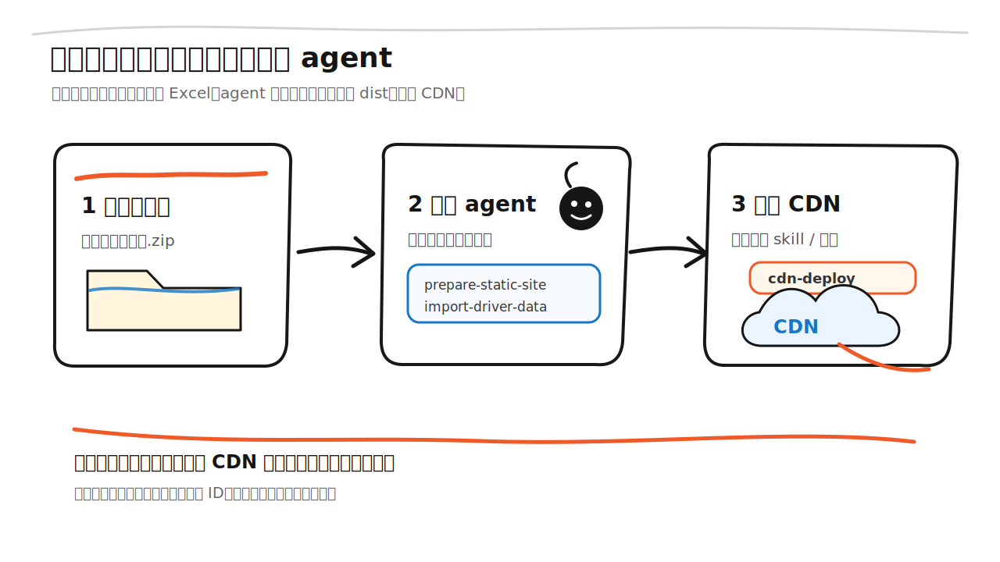
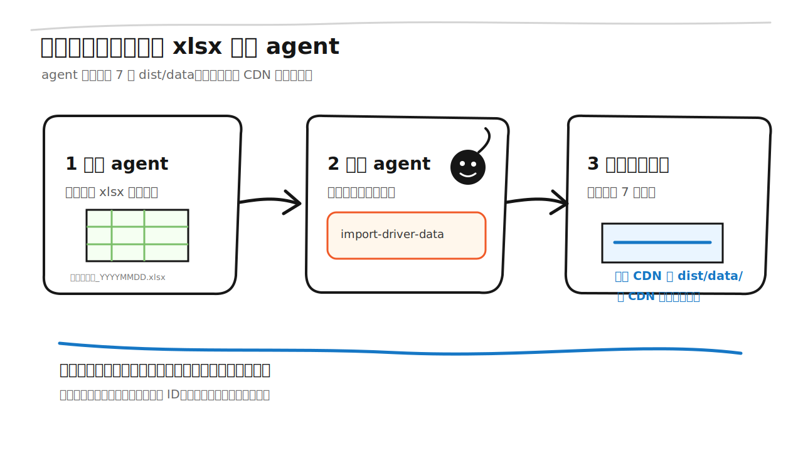

# 每日更新说明

如果聪明的你已经掌握了使用 AI 工具，那么恭喜你获得了懒人版教程：你不需要手动理解每个脚本的细节，只要把这个压缩包交给 agent，再复制本文里的提示词，就可以完成首次部署和每日更新。

这份说明用于维护和更新“司机画像”静态网站。你只需要按步骤准备 Excel、运行脚本、上传 CDN，就可以把最新数据发布给同事使用。

## 目录

- [第一部分：懒人版（直接指挥 agent）](#第一部分懒人版直接指挥-agent)
  - [需要哪些 skill](#需要哪些-skill)
  - [最推荐的一键更新部署提示词](#最推荐的一键更新部署提示词)
  - [首次部署提示词](#首次部署提示词)
  - [每日更新提示词](#每日更新提示词)
- [第二部分：详细版（按步骤操作）](#第二部分详细版按步骤操作)
  - [你会拿到什么](#你会拿到什么)
  - [第一次部署同款网站](#一第一次部署同款网站)
  - [每天拿到最新一天数据后更新网站](#二每天拿到最新一天数据后更新网站)
  - [常见问题](#常见问题)

---

## 第一部分：懒人版（直接指挥 agent）

你可以把压缩包发给公司内网 agent（SmartWork、Codex 或其他支持文件操作和 CDN 部署的 agent），再把最新 Excel 直接拖给它。最推荐的做法是：每次更新都让 agent 生成一个新的 CDN 路径，并返回新的 `index.html` 链接。

### 需要哪些 skill

生成数据本身不需要额外 skill，压缩包里的脚本就能完成：

```text
scripts/prepare-static-site.py
scripts/import-driver-data.py
```

上传 CDN 才需要部署能力。推荐优先使用目录部署能力：

```text
cdn-dir-deploy
cdn-deploy
```

压缩包里会带部署 skill，位置是：

```text
skills/cdn-deploy/SKILL.md
```

你不需要自己判断怎么安装。直接让 agent 读取压缩包里的 `skills/cdn-deploy/SKILL.md`，并按它自己的工具机制使用目录上传。如果它有内置 `cdn-dir-deploy`，优先用内置目录上传；如果没有，再用项目里的脚本：

```text
python3 scripts/cdn-dir-deploy.py --dir dist --deploy-id driver-profile-YYYYMMDD-HHMM
```

如果当前 agent 环境不能访问公司内网 CDN，它仍然可以生成并检查 `dist/`，但无法真正上线。这时需要换到能访问内网 CDN 的 agent 执行最后一步。

### 最推荐的一键更新部署提示词

这个提示词适合直接发给公司内网 agent。使用方式是：把项目压缩包和最新 Excel 拖给 agent，然后复制下面整段话。agent 应该自动处理附件路径、生成静态数据、部署 CDN，并把可访问链接发回来。

> 建议默认使用新的 `deploy-id`，例如 `driver-profile-YYYYMMDD-HHMM`。这样可以避开 CDN 和浏览器长期缓存，减少“明明部署了但同事看到旧页面”的问题。

```text
请帮我一键更新并部署“司机画像”静态网站到公司内网 CDN，最后直接返回可访问的 CDN index.html 链接。

我已经把项目压缩包或项目文件夹，以及最新 Excel 文件拖给你了。请直接读取我上传的附件，不要让我手动提供本地路径。

请严格按下面流程执行：

1. 准备项目目录：
   - 如果我上传的是压缩包，请先解压并进入解压后的项目根目录。
   - 如果我上传的是文件夹，请直接进入项目根目录。
   - 项目根目录应能看到 AGENTS.md、scripts/、docs/、skills/、reference/。

2. 先阅读这些文件，确认规则：
   - AGENTS.md
   - skills/cdn-deploy/SKILL.md
   - docs/数据更新与CDN发布规则.md
   - docs/每日更新说明.md

3. 确认这是多文件稳定静态站点：
   - 入口是 dist/index.html
   - 数据在 dist/data/
   - dist/data/drivers.json 是日期索引
   - 每一天司机明细在 dist/data/daily/drivers-YYYY-MM-DD.json
   - 不使用 index-inline.html
   - 不允许只上传单个 HTML、widget.json 或单个 JSON
   - 必须递归上传整个 dist/ 目录并保留相对路径

4. 处理我上传的 Excel：
   - 如果这个 Excel 已经包含最近 7 天或合并后的数据，直接作为导入源。
   - 如果这个 Excel 只包含最新一天，请检查项目里是否已有 data/incoming/ 下最近 6 天的历史 Excel。
   - 如果有最近 6 天历史 Excel，请先用 pandas 合并最近 7 天输入，生成临时合并文件后再导入。
   - 如果既只有当天 Excel、又没有最近 6 天历史输入，请明确告诉我：当前只能生成当天数据，无法凭空补齐 7 天窗口；然后询问我是否继续只发布当天，或让我补传最近 7 天/合并文件。

5. 确认上传日期：
   - 优先从文件名中的 YYYYMMDD 推断。
   - 如果无法推断，请向我确认上传日期。
   - 生成窗口必须是 upload_date 向前含当天的最新 7 个自然日。

6. 生成前端和数据产物：
   python3 scripts/prepare-static-site.py --out-dir dist
   python3 scripts/import-driver-data.py <Excel或合并后的数据文件路径> --upload-date YYYY-MM-DD --out-dir dist/data

   导入性能参考：
   - 正常未超过 800MB 时，脚本只完整解码一次近七天 daily 文件，不会为 manifest、meta 和筛选项反复重读。
   - 已验证的真实数据基准约为 2-4 分钟：2026-07-15 完整导入 154 秒，2026-07-16 完整导入 181.47 秒。
   - 如果相同数据量仍需要十几到二十分钟，先确认公司 Agent 使用的是最新 `scripts/import-driver-data.py`，并检查日志中是否重复出现多次窗口 daily 解码。

7. 生成后必须检查：
   - dist/index.html 存在
   - dist/app.js 存在
   - dist/styles.css 存在
   - dist/data/drivers.json 存在
   - dist/data/daily/drivers-YYYY-MM-DD.json 按日期独立存在
   - dist/data/filter-options.json 存在
   - dist/data/manifest.json 存在
   - dist/data/strategy-thresholds.json 存在
   - manifest.generated_at 是本次生成的实时时间
   - manifest.window_start/window_end 是最近 7 天窗口
   - manifest.row_count 与当前 7 天窗口内已保留日期总数据量一致
   - 导入 2026-07-07 后，仍在 7 天窗口内的 2026-07-03 日期文件不能丢失
   - dist 总大小低于 800MB
   - index.html 引用的是本次新生成的 app.<build-id>.js
   - 页面包含加载进度条 loadProgress
   - 高级筛选包含 isOrganizedSelect / 是否组织化
   - python3 tests/test_import_driver_data.py 通过
   - node tests/progress-monotonic.test.mjs 通过
   - node tests/filter-index-contract.mjs 通过
   - node tests/lookup-index-contract.mjs 通过
   - node tests/filter-worker-performance.mjs 通过

8. 本地预览验收：
   python3 -m http.server 8000 --directory dist
   打开 http://localhost:8000/index.html 后检查：
   - 页面能打开
   - 进入时有静态数据加载进度条
   - 高级筛选里有“是否组织化”
   - 城市查询能显示左侧司机列表
   - 点击司机后右侧能显示综合画像、建议策略、司机资料
   - 下载 CSV 可用

9. 部署 CDN：
   请使用目录递归上传能力，也就是 cdn-dir-deploy / cdn-deploy 这一类能力。
   优先使用你当前内网 agent 自带的 cdn-dir-deploy；如果没有内置能力，但项目内脚本可用，请执行：
   python3 scripts/cdn-dir-deploy.py --dir dist --deploy-id driver-profile-YYYYMMDD-HHMM

   注意：
   - deploy-id 请使用本次日期时间生成新的，不要继续覆盖旧路径，避免缓存。
   - 必须上传整个 dist/ 目录。
   - 必须保留 data/ 子目录结构。
   - 不要上传 SmartWork 包装页链接作为最终结果；最终给我 CDN 的 index.html 直链。

10. 部署后验证 CDN：
   - <CDN链接>/index.html 返回 200
   - <CDN链接>/data/manifest.json 返回 200
   - <CDN链接>/data/drivers.json 返回 200
   - <CDN链接>/data/filter-options.json 返回 200
   - index.html 中能搜到 app.<build-id>.js
   - index.html 中能搜到 loadProgress
   - index.html 中能搜到 isOrganizedSelect
   - 打开 <CDN链接>/index.html 后能看到加载进度条和“是否组织化”筛选
   - 查询城市后左侧能显示司机列表，点击司机后右侧能显示详情

11. 最后请把结果按这个格式发给我：
   - CDN 链接：
   - 数据窗口：
   - 司机数据条数：
   - dist 大小：
   - 生成时间：
   - deploy-id：
   - 是否已验证进度条：
   - 是否已验证“是否组织化”筛选：
   - 是否已验证查询和司机详情：
```

### 首次部署提示词



第一次部署时，把这段复制给 agent：

```text
请解压并检查我提供的司机画像网站包，然后完成首次 CDN 静态站点部署，并返回可访问的 CDN index.html 链接。

要求：
1. 先进入网站包根目录，检查是否能看到 AGENTS.md、scripts/、docs/、skills/、reference/。
2. 阅读 AGENTS.md、skills/cdn-deploy/SKILL.md、docs/数据更新与CDN发布规则.md，确认这是多文件稳定静态站点。
3. 如果当前 agent 有内置 cdn-dir-deploy，请优先使用目录递归上传能力；如果没有内置能力，请使用项目脚本 scripts/cdn-dir-deploy.py。
4. 在网站包根目录执行：
   python3 scripts/prepare-static-site.py --out-dir dist
5. 我会把第一份 Excel 文件直接上传或拖给你。请读取我上传的这个附件；如果文件名能推断日期，可以不传 --upload-date；如果不能推断，请向我确认上传日期。附件保存位置由你自行处理，不需要我提供路径。
6. 请用你保存后的 Excel 文件路径生成数据，命令格式为：
   python3 scripts/import-driver-data.py <你保存的Excel文件路径> --upload-date YYYY-MM-DD --out-dir dist/data
7. 本地预览：
   python3 -m http.server 8000 --directory dist
8. 检查页面能打开、司机 ID 查询可用、城市/公司/产品线筛选可用、CSV 下载可用。
9. 检查 dist/data/manifest.json 里的 generated_at、window_start、window_end、row_count。
10. 检查 dist/data/drivers.json 是否存在，且它是日期索引，不是多天司机明细大文件。
11. 检查 dist/data/daily/drivers-YYYY-MM-DD.json 是否按日期独立存在。
12. 检查 dist/data/filter-options.json 和 strategy-thresholds.json 是否存在。
13. 检查 dist/ 总体积没有超过 CDN 限制。
14. 注意：本项目入口是 dist/index.html，不需要 index-inline.html，也不要把所有数据内联成单个 HTML。
15. 使用新的 deploy-id 递归上传整个 dist/，例如：
   python3 scripts/cdn-dir-deploy.py --dir dist --deploy-id driver-profile-YYYYMMDD-HHMM
16. 重要：这是多文件静态站点，不能只上传 dist/index.html、index-inline.html、widget.json 或任何单个 HTML 文件。CDN 必须保留 dist/ 内的相对路径，让 /index.html、/app.<build-id>.js、/styles.<build-id>.css、/data/manifest.json、/data/drivers.json、/data/daily/drivers-YYYY-MM-DD.json 和 /data/filter-options.json 都能访问。
17. 部署后打开 CDN index.html 链接验证：加载进度条、是否组织化筛选、数据日期切换、城市查询、左侧司机列表、右侧司机详情都可用。

完成后告诉我：
- 本地预览地址
- CDN 链接
- 数据窗口
- 司机数据条数
- dist/ 是否可以上传 CDN
- 是否已完成 CDN 验证
```

### 每日更新提示词



如果只是日常更新数据，也可以使用下面这个较短版本。为了最省事，优先使用上一节“最推荐的一键更新部署提示词”；下面这段适合已经熟悉项目的 agent。

```text
请在司机画像网站包根目录执行每日数据更新。

我会把最新一天的 xlsx 文件直接上传或拖给你。
请读取我上传的这个 Excel 附件。附件保存位置由你自行处理，不需要我提供路径。

上传日期：
YYYY-MM-DD

请先判断这个 Excel 是否包含最近 7 天或合并数据：
- 如果包含最近 7 天或合并数据，直接导入。
- 如果只包含最新一天，请尝试使用 data/incoming/ 下已有最近 6 天历史文件合并。
- 如果无法补齐最近 7 天，请告诉我当前只能发布当天数据，等待我确认后再继续。

请用你保存后的 Excel 或合并文件路径运行导入脚本，命令格式为：
python3 scripts/import-driver-data.py <Excel或合并文件路径> --upload-date YYYY-MM-DD --out-dir dist/data

完成后请检查：
1. dist/data/manifest.json 的 generated_at 是否是当前生成时间。
2. window_start/window_end 是否为上传日向前含当天的最近 7 天。
3. dist/data/drivers.json 是否存在，且它是日期索引，不是多天司机明细大文件。
4. dist/data/daily/drivers-YYYY-MM-DD.json 是否按日期独立存在。
5. dist/data/filter-options.json 和 strategy-thresholds.json 是否存在。
6. 导入新一天数据后，仍在 7 天窗口内的旧日期文件是否保留。
7. 输出目录大小是否低于 800MB。
8. 本地用 python3 -m http.server 8000 --directory dist 预览，确认页面可打开、切换数据日期、查询和筛选可用。
9. 注意：这里的“覆盖 dist/data/”不是只保留当天，也不是永久累计历史；脚本会保留上传日向前含当天的最近 7 天按日独立文件，再用这份新 dist/data/ 覆盖 CDN 上旧的 dist/data/。
10. 如果使用新的 deploy-id，例如 driver-profile-YYYYMMDD-HHMM，请递归上传整个 dist/，并返回新的 CDN 链接。
11. 如果公司内部明确要求沿用旧链接，并且页面代码没有变化，才只递归覆盖旧 CDN 路径下的 dist/data/。
12. 重要：每日更新也不是上传单个 JSON 或单个 HTML，而是递归上传整个 dist/ 或覆盖 dist/data/，并保留 data/drivers.json、data/daily/、manifest.json、filter-options.json、strategy-thresholds.json 这些文件路径。
13. 如果 cdn-deploy / cdn-dir-deploy 可用，请直接用目录递归上传能力部署。
14. 部署时优先使用新的 deploy-id，例如 driver-profile-YYYYMMDD-HHMM；最终把 CDN index.html 直链发给我。
15. 部署后请验证进度条、是否组织化筛选、数据日期切换、查询结果列表和司机详情都可用。

完成后告诉我：
- 数据窗口
- 生成时间
- 司机数据条数
- 是否已上传 CDN
- CDN 链接
- 是否验证了页面能查询和打开司机详情
```

---

## 第二部分：详细版（按步骤操作）

## 你会拿到什么

后续会提供一个压缩包。解压后，文件夹结构以压缩包为准，建议如下：

```text
司机画像网站包/
├── README_先读我.md
├── docs/
│   └── 每日更新说明.md
├── reference/
│   └── current-cdn-frontend/
│       ├── index.html
│       ├── app.js
│       └── styles.css
├── scripts/
│   ├── prepare-static-site.py
│   └── import-driver-data.py
├── skills/
│   └── cdn-deploy/
│       └── SKILL.md
├── data/
│   └── incoming/
└── dist/
```

其中：

- `data/incoming/`：放每天从公司平台导出的 Excel。
- `dist/`：准备上传到 CDN 的静态网站目录。
- `scripts/prepare-static-site.py`：第一次部署时准备网站前端文件。
- `scripts/import-driver-data.py`：每天导入 Excel 并生成 CDN 数据。
- `skills/cdn-deploy/`：随压缩包提供的 CDN 部署 skill，给支持 skill 或插件机制的 agent 使用。

真实 Excel 只放在本地 `data/incoming/`，不要放进文档示例或公开分享。

## 这套流程的效果

完成后可以做到：

- 第一次部署时，把压缩包里的网站生成到 `dist/`，再上传整个 `dist/` 到 CDN。
- 每天拿到新 Excel 后，重新生成最近 7 天数据窗口。
- 最推荐每天用新的 `deploy-id` 上传整个 `dist/`，拿到一个新的 CDN `index.html` 直链。
- 如果公司内部明确要求沿用旧链接，也可以只递归覆盖旧 CDN 路径下的 `dist/data/`。

不需要每天改网站代码。日常更新只处理数据。

## 工作方式

静态网站由两部分组成：

| 部分 | 内容 | 什么时候变 |
|---|---|---|
| 网站前端 | `index.html`、`app.js`、`styles.css` | 页面功能改动时才变 |
| 数据产物 | `dist/data/*.json` | 每天拿到新 Excel 后更新 |

为了减少部署缺文件和多路径失效风险，网站采用：

```text
稳定静态版
```

效果是：

- 打开首页时，先读取 `drivers.json` 日期索引、筛选项和 manifest。
- 切换数据日期时，读取对应的 `daily/drivers-YYYY-MM-DD.json`。
- 点击某个司机后，直接展示该日期文件里已经加载的静态档案，不再二次请求单司机详情文件。
- CDN 包不会持续累计历史数据，只保留上传日向前含当天的最新 7 天。

## 一、第一次部署同款网站

### 1. 解压网站包

把收到的压缩包解压到一个固定位置，例如：

```text
司机画像网站包/
```

打开这个文件夹，确认至少能看到：

```text
scripts/prepare-static-site.py
scripts/import-driver-data.py
reference/current-cdn-frontend/index.html
reference/current-cdn-frontend/app.js
reference/current-cdn-frontend/styles.css
```

### 2. 确认 Python 可用

在项目根目录运行：

```bash
python3 --version
```

如果命令不可用，交给 agent 处理 Python 环境。

脚本读取 Excel 需要：

```text
pandas
openpyxl
```

如果缺少依赖，也交给 agent 安装或使用当前 agent 自带的运行时。

### 3. 准备网站前端文件

在项目根目录运行：

```bash
python3 scripts/prepare-static-site.py --out-dir dist
```

运行后会生成：

```text
dist/index.html
dist/app.js
dist/styles.css
```

### 4. 放入第一份 Excel

把公司平台导出的 Excel 放到：

```text
data/incoming/
```

建议文件名带日期，例如：

```text
data/incoming/司机库数据_20260706.xlsx
```

### 5. 生成 CDN 数据

如果文件名里的日期就是上传日期，可以运行：

```bash
python3 scripts/import-driver-data.py data/incoming/司机库数据_20260706.xlsx --out-dir dist/data
```

也可以明确指定上传日期：

```bash
python3 scripts/import-driver-data.py data/incoming/司机库数据_20260706.xlsx --upload-date 2026-07-06 --out-dir dist/data
```

脚本会生成：

```text
dist/data/drivers.json
dist/data/daily/drivers-YYYY-MM-DD.json
dist/data/filter-options.json
dist/data/meta.json
dist/data/manifest.json
dist/data/strategy-thresholds.json
```

### 6. 本地检查

在项目根目录运行：

```bash
python3 -m http.server 8000 --directory dist
```

浏览器打开：

```text
http://localhost:8000
```

检查：

- 页面标题是 `司机画像`。
- 左侧显示 `静态站点生成时间`。
- 输入一个存在的司机 ID 可以打开详情。
- 城市、公司、产品线筛选能用。
- 下载 CSV 只有允许字段。

### 7. 上传 CDN

第一次部署时，上传整个目录：

```text
dist/
```

这里的上传必须是“递归多文件上传”：把 `dist/` 里面的所有文件和子目录一起上传，并保留相对路径。不能只上传 `dist/index.html`，也不能改成 `index-inline.html` 或 `widget.json` 单文件发布。

上传后 CDN 至少应该能访问这些路径：

```text
/index.html
/app.<build-id>.js
/styles.<build-id>.css
/data/manifest.json
/data/drivers.json
/data/filter-options.json
```

如果当前 CDN 工具只支持单个 HTML 或 widget 上传，这个工具不适合本项目；需要换成支持目录递归上传的 CDN 工具，或让 agent 给出手动目录上传步骤。

如果你使用 agent 一键部署，请让 agent 优先使用 `cdn-dir-deploy` 这类目录上传能力。压缩包里如果带有 `skills/cdn-deploy/`，agent 可以直接阅读其中的规则；如果它没有内置目录上传能力，可以使用项目脚本：

```bash
python3 scripts/cdn-dir-deploy.py --dir dist --deploy-id driver-profile-YYYYMMDD-HHMM
```

如果暂时没有部署 skill，也可以先完成本地生成和检查，再按公司已有 CDN 控制台或上传工具手动上传 `dist/`。

上传后会得到一个 CDN 链接，例如：

```text
https://cdn.example.com/driver-profile/index.html
```

把这个链接发给同事即可。

## 二、每天拿到最新一天数据后更新网站

### 1. 从公司平台导出 Excel

从公司平台导出新一天司机数据。

建议命名：

```text
司机库数据_YYYYMMDD.xlsx
```

例如：

```text
司机库数据_20260707.xlsx
```

### 2. 放到固定目录

放到：

```text
data/incoming/
```

### 3. 运行导入脚本

在项目根目录运行：

```bash
python3 scripts/import-driver-data.py data/incoming/司机库数据_20260707.xlsx --upload-date 2026-07-07 --out-dir dist/data
```

脚本会自动：

- 读取 Excel。
- 只保留 2026-07-01 至 2026-07-07 的数据。
- 生成最近 7 天稳定静态数据索引 `drivers.json`。
- 按自然日生成或保留 `daily/drivers-YYYY-MM-DD.json`。
- 更新新一天数据时，不会删除仍在 7 天窗口内的旧日期文件。
- 更新筛选项。
- 更新 `manifest.generated_at` 实时生成时间。
- 检查 `dist/data` 是否超过 800MB。

### 4. 本地抽查

在项目根目录运行：

```bash
python3 -m http.server 8000 --directory dist
```

浏览器打开：

```text
http://localhost:8000
```

抽查：

- `静态站点生成时间` 是否变成刚刚生成的时间。
- 数据日期是否包含最新一天。
- 查询最新 Excel 中存在的司机 ID。
- 筛选和下载 CSV 是否正常。

### 5. 上传 CDN

日常更新最推荐的部署方式是：使用新的 `deploy-id` 递归上传整个 `dist/`。这样每次都会得到一个新的 CDN `index.html` 直链，最不容易遇到缓存导致的旧页面。

```bash
python3 scripts/cdn-dir-deploy.py --dir dist --deploy-id driver-profile-YYYYMMDD-HHMM
```

如果公司内部明确要求沿用旧链接，并且页面功能没有变化，才选择只覆盖上传数据目录：

```text
dist/data/
```

这里的“覆盖上传”指用脚本重新生成的最近 7 天完整数据窗口替换 CDN 上旧的 `dist/data/`。它不是只上传当天一份文件，也不是把历史数据一直追加到 CDN。

日常更新同样必须是递归多文件上传：`dist/data/manifest.json`、`drivers.json`、`daily/`、`filter-options.json` 和 `strategy-thresholds.json` 都要一起覆盖，且路径结构不能变。

如果是第一次部署、页面代码有变化、刚运行过 `prepare-static-site.py`，或者不确定前端有没有变化，则上传整个：

```text
dist/
```

如果 `cdn-dir-deploy` 或 `cdn-deploy` 能力可用，可以让 agent 直接使用它完成上传；如果没有，就先让 agent 告诉你本次生成的目录和检查结果，再按手动上传方式处理。

上传完成后，如果选择覆盖旧路径，原来的 CDN 链接通常可以继续使用；如果按推荐方式使用新的 `deploy-id`，请把本次新生成的 CDN `index.html` 直链发给同事。为了避免 CDN 或浏览器缓存导致看到旧页面，更推荐每天使用新的 `deploy-id`。

## 常见问题

### 需要每天重新部署网站代码吗？

不需要每天修改网站代码。最推荐让 agent 每天重新生成数据后，用新的 `deploy-id` 上传整个 `dist/`，这样能绕开缓存；如果必须沿用旧链接，并且页面功能没有变化，才只覆盖上传 `dist/data/`。

### 为什么只保留最近 7 天？

因为 CDN 一键部署包有 800MB 上限，而且访问者打开页面时会下载静态文件。只保留最近 7 天可以控制包大小和打开速度。

### 为什么使用稳定静态版 drivers.json？

为了减少部署时的文件数量和路径出错概率。

```text
drivers.json：最近 7 天窗口内的日期索引和每日文件清单
daily/drivers-YYYY-MM-DD.json：对应自然日的页面查询、筛选、列表、详情和建议策略展示所需数据
filter-options.json：筛选候选项
manifest.json：生成时间、上传日期、数据窗口和条数
```

### Excel 文件名里的日期是什么意思？

建议文件名中的日期代表上传日期或数据日期。例如：

```text
司机库数据_20260707.xlsx
```

脚本会把它理解为：

```text
upload_date = 2026-07-07
```

如果文件名没有日期，可以用 `--upload-date 2026-07-07` 明确指定。

### 同一个司机 7 天内出现多次怎么办？

当前脚本会保留多条记录，每条记录按 `司机ID + 数据日期` 生成详情路径。筛选结果里可能出现同一个司机的不同日期快照。

如果后续希望“同一司机只显示最新一条”，可以让 agent 增加去重规则。
